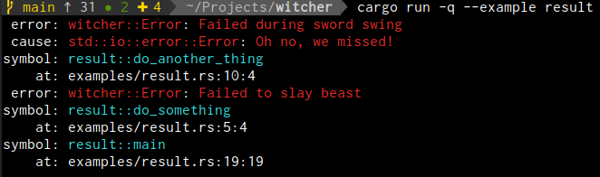

# witcher
Track and put down bugs using simple concise error handling

Avoid terminating execution randomly in your code with `panics` via `unwrap` and `expect` varients,
or laboriously writing custom enum wrapers, or having to work with `Box` types which is messy;
instead use `Result<T>` from witcher as the return type and `wrap` errors easily for additional
contextual messaging automatically propogated up the stack. witcher implements `std::error::Error`
retaining downcasting and chaining. Best of all witcher provides the holy grail: `automatic
simplified backtraces`.



## What you get <a name="what-you-get"/></a>
1. ***Error handling simplified***  
   > by providing type matching on errors  
   > by automatically handling conversions  
   > by providing concise and terse user interaction  
   > by providing conditional colored output
2. ***Error handling that tells the full story***  
   > by implementing `std::error::Error`  
   > by chaining errors together  
   > by providing contextual messaging  
   > by providing tracing from point of origin  
3. ***Safety***
   > 100% safe code without any use of `unsafe`  
   > Zero low level TraitObject manipulation  
   > Simple code base with only a couple 100 lines  
   > Well tested with over 90% code coverage  

---

### Quick links
* [Usage](#usage)
  * [Retries](#retries)
    * [err\_is](#err_is)
    * [retry\_on](#retry_on)
* [License](#license)
* [Backlog](#backlog)

## Manifesto <a name="manifesto"/></a>
Coming from a Golang background, most recently, I fully expected to just import the defacto standard
error package in Rust similar to something like Golang's [pkg/errors](https://github.com/pkg/errors)
and I'd be off to the races. Instead, as I dug, I found a rich anthropological layered history of
a myriad of projects and authors all professing nobal ideals and principles all trying to solve the
same issue. Rust's error handling story isn't full featured enough by itself yet. It feels a lot like
Golang's before the existance of `pkg/errors`. I found a few projects clearly more used than others
and saw the tide turn on once popular packages. Literally weeks of research and testing of numerous
different patterns and packages later though I have still yet to find anything as simple and usable
as the venerable [pkg/errors](https://github.com/pkg/errors). Thus `witcher` was born.

As a side note I moved all my research on low level TraitObject manipulation, when I was going down
the rabbit hole, over to [phR0ze/rust-examples](https://github.com/phR0ze/rust-examples) and am happy
to say `witcher` is 100% safe code.

# Usage <a name="usage"/></a>
Return `Result<T>` from witcher and use `wrap` to automatically chain errors and add additional
contextual messaging at the same time. `wrap` returns a `Result<T>` so there are fewer symbols and
less typing needed.

***Requires Rust >= 1.30*** see https://doc.rust-lang.org/std/error/trait.Error.html#method.source

Example code:
```toml
[dependencies]
witcher = "0.1"
```

```rust
// Import the essentials of error handling with a single line
use witcher::prelude::*;

// Wrap our internal error with additional context as we move up the stack
fn do_something() -> Result<()> {
    do_another_thing().wrap("Failed to slay beast")

    // try again based on error matching?
}

// Wrap the external error with additional context
fn do_another_thing() -> Result<()> {
    do_external_thing().wrap("Failed during sword swing")
}

// Function that returns an external error type outside our codebase
fn do_external_thing() -> std::io::Result<()> {
    Err(std::io::Error::new(std::io::ErrorKind::Other, "Oh no, we missed!"))
}

fn main() {
    println!("{}", do_something().unwrap_err());
}
```

## Retries <a name="retries"/></a>
We can retry failing code with a few different `Result` extension functions.

#### `err_is` - *will return true if an error exists and is the given type* <a name="err_is"/></a>
```rust
use witcher::prelude::*;

fn retry_on_concreate_error_type_using_err_is() -> Result<()> {
    let mut retries = 0;
    let mut result = do_external_thing();
    while retries < 3 && result.err_is::<std::io::Error>() {
        retries += 1;
        println!("retrying using err_is #{}", retries);
        result = do_external_thing();
    }
    result.wrap("Failed while attacking beast")
}
fn do_external_thing() -> std::io::Result<()> {
    Err(std::io::Error::new(std::io::ErrorKind::Other, "Oh no, we missed!"))
}

fn main() {
    println!("{}", retry_on_concreate_error_type_using_err_is().unwrap_err());
}
```

#### `retry_on` - *is a cleaner simplified way to do a similar thing as our err_is example* <a name="retry_on"/></a>
```rust
use witcher::prelude::*;

fn retry_on_concreate_error_type() -> Result<()> {
    do_external_thing().retry_on(3, TypeId::of::<std::io::Error>(), |i| {
        println!("std::io::Error: retrying! #{}", i);
        do_external_thing()
    }).wrap("Failed while attacking beast")
}
fn do_external_thing() -> std::io::Result<()> {
    Err(std::io::Error::new(std::io::ErrorKind::Other, "Oh no, we missed!"))
}

fn main() {
    println!("{}", retry_on_concreate_error_type().unwrap_err());
}
```

#### `retry` - *is similar to `retry_on` but doesn't take the type of error into account* <a name="retry"/></a>
```rust
use witcher::prelude::*;

fn retry() -> Result<()> {
    do_external_thing().retry(3, |i| {
        println!("std::io::Error: retrying! #{}", i);
        do_external_thing()
    }).wrap("Failed while attacking beast")
}
fn do_external_thing() -> std::io::Result<()> {
    Err(std::io::Error::new(std::io::ErrorKind::Other, "Oh no, we missed!"))
}

fn main() {
    println!("{}", retry().unwrap_err());
}
```

## License <a name="license"/></a>
This project is licensed under either of:
 * MIT license [LICENSE-MIT](LICENSE-MIT) or http://opensource.org/licenses/MIT
 * Apache License, Version 2.0 [LICENSE-APACHE](LICENSE-APACHE) or http://www.apache.org/licenses/LICENSE-2.0

### Contribution <a name="contribution"/></a>
Unless you explicitly state otherwise, any contribution intentionally submitted for inclusion in
this project by you, as defined in the Apache-2.0 license, shall be dual licensed as above, without
any additional terms or conditions.

---

## Backlog <a name="backlog"/></a>
* Mechanism for converting to JSON
* More output options based on `{}, {:#}, {:?}, {:#?}`
* `bail!` macro for immediate returns combining `Error::new` and `Error::wrap`
* `root` function to surface the root of the chain easily for type matching   
