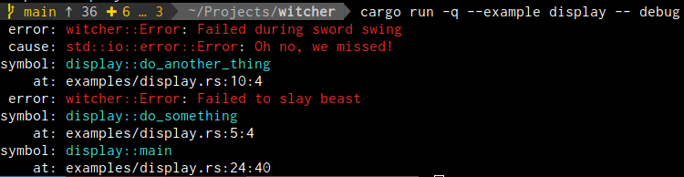
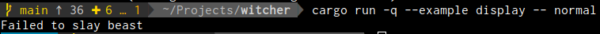
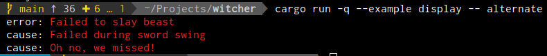

# witcher
[](https://opensource.org/licenses/MIT)
[](https://github.com/phR0ze/witcher/actions)
[](https://codecov.io/gh/phR0ze/witcher)
[](https://crates.io/crates/witcher)
[](https://github.com/phR0ze/witcher#rustc-requirements)

***Track and put down bugs using simple concise error handling***

Avoid terminating execution randomly in your code with `panics` via `unwrap` and `expect` varients,
or laboriously writing custom enum wrapers, or having to work with `Box` types which is messy;
instead use `Result<T>` from witcher as the return type and `wrap` errors easily for additional
contextual messaging automatically propogated up the stack. witcher implements `std::error::Error`
retaining downcasting and chaining. Best of all witcher provides the holy grail: `automatic
simplified backtraces`.



## What you get <a name="what-you-get"/></a>
1. ***Error handling simplified***  
   > by providing type matching on errors  
   > by automatically handling conversions  
   > by providing concise and terse user interaction  
   > by providing conditional colored output
2. ***Error handling that tells the full story***  
   > by implementing `std::error::Error`  
   > by chaining errors together  
   > by providing contextual messaging  
   > by providing tracing from point of origin  
3. ***Safety***
   > 100% safe code without any use of `unsafe`  
   > Zero low level TraitObject manipulation  
   > Well tested with over 90% code coverage  

---

### Quick links
* [Usage](#usage)
  * [Rustc requirments](#rustc-requirements)
  * [Color](#color)
  * [Downcasting](#downcasting)
    * [downcast\_ref](#downcast_ref)
    * [match\_err](#match_err)
  * [Chaining](#chaining)
    * [source](#source)
  * [Retries](#retries)
    * [err\_is](#err_is)
    * [retry\_on](#retry_on)
  * [Display](#display)
    * [Normal](#display-normal)
    * [Alternate](#display-alternate)
    * [Debug](#display-debug)
    * [Alternate Debug](#display-alternate-debug)
* [Contribute](#contribute)
  * [Git-Hook](#git-hook)
* [License](#license)
  * [Contribution](#contribution)
* [Backlog](#backlog)
* [Changelog](#changelog)

## Manifesto <a name="manifesto"/></a>
Coming from a Golang background, most recently, I fully expected to just import the defacto standard
error package in Rust similar to something like Golang's [pkg/errors](https://github.com/pkg/errors)
and I'd be off to the races. Instead, as I dug, I found a rich anthropological layered history of
a myriad of projects and authors all professing nobal ideals and principles all trying to solve the
same issue. Rust's error handling story isn't full featured enough by itself yet. It feels a lot like
Golang's before the existance of `pkg/errors`. I found a few projects clearly more used than others
and saw the tide turn on once popular packages. Literally weeks of research and testing of numerous
different patterns and packages later though I have still yet to find anything as simple and usable
as the venerable [pkg/errors](https://github.com/pkg/errors). Thus `witcher` was born.

As a side note I moved all my research on low level TraitObject manipulation, when I was going down
the rabbit hole, over to [phR0ze/rust-examples](https://github.com/phR0ze/rust-examples) and am happy
to say `witcher` is 100% safe code.

# Usage <a name="usage"/></a>
Use the `wrap` extension method on `Result` types to wrap the error with additional contextual
messaging and automatically chain errors together. `wrap` returns a `Result<T>` so there are fewer
symbols and less typing needed.

#### Requires rustc >= 1.30 <a name="rustc-requirements"/></a>
This minimum rustc requirement is driven by the enhancemnts made to [Rust's `std::error::Error`
handling improvements](https://doc.rust-lang.org/std/error/trait.Error.html#method.source)

1. Import witcher in your `Cargo.toml` and keep debug symbols
   ```toml
   [dependencies]
   witcher = "0.1"

   [profile.release]
   debug = true
   ```
2. Use the witcher prelude
   ```rust
   use witcher::prelude::*;
   ```
3. Use the `Result<T>` alias as your return type
   ```rust
   fn do_something() -> Result<()>;
   ```
4. Use the `wrap` extension method on Result to provide context
   ```rust
   fn do_something() -> Result<()> {
       do_external_thing().wrap("Failed to slay beast")
   }
   fn do_external_thing() -> std::io::Result<()> {
       Err(std::io::Error::new(std::io::ErrorKind::Other, "Oh no, we missed!"))?
   }
   ```

## Color <a name="color"/></a>
Color is automatically controlled by the [gory](https://crates.io/crates/gory) based on `tty`
detection. You can disable color manually by setting the `TERM_COLOR` environment variable to
something falsy see [gory docs on controlling use]( https://github.com/phR0ze/gory#control-use).

```bash
$ TERM_COLOR=0 cargo run -q --example simple
```

## Downcasting <a name="downcasting"/></a>
We can match on error types using downcasting or with the `match_err!` macro.

#### `downcast_ref` - *access std::error::Error's downcast_ref* <a name="downcast_ref"/></a>
```rust
use witcher::prelude::*;

// Wrap our internal error with additional context as we move up the stack
fn do_something() -> Result<()> {
    do_external_thing().wrap("Failed to slay beast")
}

// Function that returns an external error type outside our codebase
fn do_external_thing() -> std::io::Result<()> {
    Err(std::io::Error::new(std::io::ErrorKind::Other, "Oh no, we missed!"))?
}

fn main() {
    let err = do_something().unwrap_err();

    // Get the last error in the error chain which will be the root cause
    let root_cause = err.last();

    // Match single concrete error type
    if let Some(e) = root_cause.downcast_ref::<std::io::Error>() {
        println!("Root cause is a std::io::Error: {}", e)
    } else {
        println!("{}", err)
    }
}
```

#### `match_err!` - *matches on concrete error typese* <a name="err_is"/></a>
```rust
use witcher::prelude::*;

fn do_something() -> Result<()> {
    do_external_thing().wrap("Failed to slay beast")
}

fn do_external_thing() -> std::io::Result<()> {
    Err(std::io::Error::new(std::io::ErrorKind::Other, "Oh no, we missed!"))?
}

fn main() {
    let err = do_something().unwrap_err();

    // Match multiple downcasted cases to handle errors differently
    match_err!(err.last(), {
        x: Error => println!("Root cause is witcher::Error: {}", x),
        x: std::io::Error => println!("Root cause is std::io::Error: {}", x),
        _ => println!("{}", err)
    });
}
```

## Chaining <a name="retries"/></a>
We can continue to leverage std::error::Error's `source` method for chaining of errors. The first
error wrapped will retain its concrete type but errors there after in the chain have lost that
information.

#### `source` - *std::error::Error's source method is exposed* <a name="source"/></a>
```rust
use witcher::prelude::*;
#[derive(Debug)]
struct SuperError {
    side: SuperErrorSideKick,
}
impl std::fmt::Display for SuperError {
    fn fmt(&self, f: &mut std::fmt::Formatter<'_>) -> std::fmt::Result {
        write!(f, "SuperError is here!")
    }
}
impl std::error::Error for SuperError {
    fn source(&self) -> Option<&(dyn std::error::Error + 'static)> {
        Some(&self.side)
    }
}

#[derive(Debug)]
struct SuperErrorSideKick;
impl std::fmt::Display for SuperErrorSideKick {
    fn fmt(&self, f: &mut std::fmt::Formatter<'_>) -> std::fmt::Result {
        write!(f, "SuperErrorSideKick is here!")
    }
}
impl std::error::Error for SuperErrorSideKick {}

fn do_something() -> Result<()> {
    do_external_thing().wrap("Failed doing super hero work")
}

fn do_external_thing() -> std::result::Result<(), SuperError> {
    Err(SuperError {side: SuperErrorSideKick})
}

fn main() {
    if let Err(err) = do_something() {

        // Traverse the error chain
        let mut source = Some(err.std());
        while let Some(err) = source {
            match_err!(err, {
                // Using alternate form of display for `Error` to get just the message
                x: Error => println!("Found witcher::Error: {:#}", x),
                x: SuperError => println!("Found SuperError: {}", x),
                x: SuperErrorSideKick => println!("Found SuperErrorSideKick: {}", x),
                _ => println!("unknown")
            });
            source = err.source();
        }
    }
}
```

## Retries <a name="retries"/></a>
We can retry failing code with a few different `Result` extension functions.

#### `err_is` - *will return true if an error exists and is the given type* <a name="err_is"/></a>
```rust
use witcher::prelude::*;

fn retry_on_concreate_error_type_using_err_is() -> Result<()> {
    let mut retries = 0;
    let mut result = do_external_thing();
    while retries < 3 && result.err_is::<std::io::Error>() {
        retries += 1;
        println!("retrying using err_is #{}", retries);
        result = do_external_thing();
    }
    result.wrap("Failed while attacking beast")
}
fn do_external_thing() -> std::io::Result<()> {
    Err(std::io::Error::new(std::io::ErrorKind::Other, "Oh no, we missed!"))
}

fn main() {
    println!("{}", retry_on_concreate_error_type_using_err_is().unwrap_err());
}
```

#### `retry_on` - *is a cleaner simplified way to do a similar thing as our err_is example* <a name="retry_on"/></a>
```rust
use witcher::prelude::*;

fn retry_on_concreate_error_type() -> Result<()> {
    do_external_thing().retry_on(3, TypeId::of::<std::io::Error>(), |i| {
        println!("std::io::Error: retrying! #{}", i);
        do_external_thing()
    }).wrap("Failed while attacking beast")
}
fn do_external_thing() -> std::io::Result<()> {
    Err(std::io::Error::new(std::io::ErrorKind::Other, "Oh no, we missed!"))
}

fn main() {
    println!("{}", retry_on_concreate_error_type().unwrap_err());
}
```

#### `retry` - *is similar to `retry_on` but doesn't take the type of error into account* <a name="retry"/></a>
```rust
use witcher::prelude::*;

fn retry() -> Result<()> {
    do_external_thing().retry(3, |i| {
        println!("std::io::Error: retrying! #{}", i);
        do_external_thing()
    }).wrap("Failed while attacking beast")
}
fn do_external_thing() -> std::io::Result<()> {
    Err(std::io::Error::new(std::io::ErrorKind::Other, "Oh no, we missed!"))
}

fn main() {
    println!("{}", retry().unwrap_err());
}
```

## Display <a name="display"/></a>
Witcher's `Error` type implements different functionality for each of the `Display` format options.
They follow a level of verbosity in witcher from least information to most i.e. ***`{}  {:#}  {:?}  {:#?}`***

#### `Normal: {}` - *will write out the first error message only* <a name="display-normal"/></a>


#### `Alternate: {:#}` - *will write out all error messages in the chain* <a name="display-alternate"/></a>


#### `Debug: {:?}` - *will write out all error messaging with simplified backtracing* <a name="display-debug"/></a>


#### `Alternate Debug: {:#?}` - *will write out all error messaging with simplified backtracing* <a name="display-alternate-debug"/></a>


## Contribute <a name="Contribute"/></a>
Pull requests are always welcome. However understand that they will be evaluated purely on whether
or not the change fits with my goals/ideals for the project.

### Git-Hook <a name="git-hook"/></a>
Enable the git hooks to have automatic version increments
```bash
cd ~/Projects/witcher
git config core.hooksPath .githooks
```

## License <a name="license"/></a>
This project is licensed under either of:
 * MIT license [LICENSE-MIT](LICENSE-MIT) or http://opensource.org/licenses/MIT
 * Apache License, Version 2.0 [LICENSE-APACHE](LICENSE-APACHE) or http://www.apache.org/licenses/LICENSE-2.0

### Contribution <a name="contribution"/></a>
Unless you explicitly state otherwise, any contribution intentionally submitted for inclusion in
this project by you, as defined in the Apache-2.0 license, shall be dual licensed as above, without
any additional terms or conditions.

---

## Backlog <a name="backlog"/></a>
* Add rust doc comments
* Mechanism for converting to JSON maybe use `{:#?}`

## Changelog <a name="changelog"/></a>
* 12/30/2020
  * Corrected the minimum required `rustc` badge
